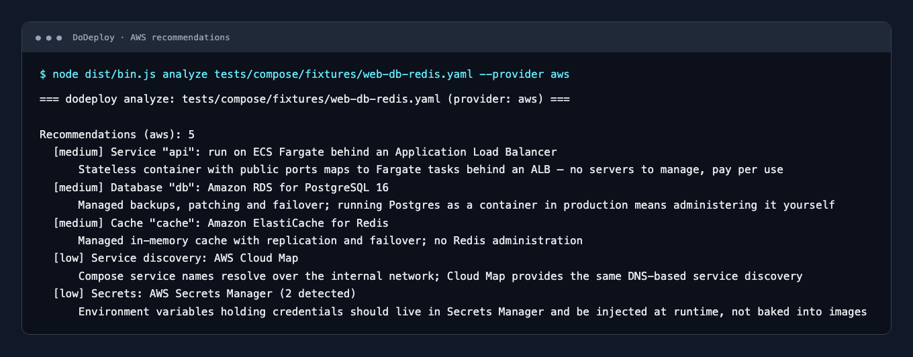

# DoDeploy

**From Docker Compose to cloud infrastructure you can review and own.**

DoDeploy is an open-source command-line tool that turns a `docker-compose.yaml`
into [Terraform](https://www.terraform.io/) configuration for **AWS, GCP, or Azure**.
It helps developers move a local container stack toward cloud deployment without
starting their infrastructure code from scratch. No Compose file yet? A guided
interview can collect your application requirements instead.

DoDeploy identifies application services, databases, caches, and storage needs,
then uses provider-specific rules to recommend cloud services with a rationale
and relative cost tier. It generates editable Terraform files and flags work that
still needs your attention. It does not provision cloud resources itself.



*Captured CLI output from the included web, PostgreSQL, and Redis example,
rendered in a terminal-style view. Recommendations describe service choices;
the supported deployment subset below explains what generation implements.*

## How it works

1. **Parse and validate:** read Compose YAML and normalize it into a cloud-neutral
   application model validated with Zod.
2. **Fill in requirements:** optionally answer prompts for the provider, budget,
   and application details.
3. **Choose services:** run provider-specific rules that attach recommendations,
   reasoning, and relative cost tiers to the model.
4. **Generate infrastructure:** render Terraform HCL into six files, with
   diagnostics and `TODO(dodeploy)` comments for deferred configuration.
5. **Review and deploy:** complete the generated configuration, then use Terraform
   to plan and apply it yourself.

```
Compose / interview ──► validated application model ──► provider rules ──► Terraform HCL
```

> Status: functional end-to-end (Phases 0–7). `generate` produces Terraform to review
> and complete before applying. CI validates representative filesets for all three
> providers; this checks provider schemas, not live deployments. Unsupported mappings
> and incomplete runtime configuration produce diagnostics and `TODO(dodeploy)` blocks.

## Technologies

| Layer | Technology | Role |
|---|---|---|
| Runtime and language | Node.js 22.12+, TypeScript, ES modules | Local CLI with strict type checking |
| Commands and prompts | Commander, `@clack/prompts` | Commands, options, and guided interviews |
| Input and validation | `yaml`, Zod | Compose parsing and runtime validation of application models and recommendations |
| Terminal presentation | Chalk, Figlet, gradient-string | Styled terminal output and banner |
| Infrastructure output | Terraform HCL, provider-specific TypeScript renderers | Editable AWS, GCP, and Azure infrastructure files |
| Build and development | tsup, tsx | Bundled CLI and direct execution from source |
| Quality checks | Vitest, V8 coverage, Biome, Lefthook | Tests, coverage thresholds, linting, formatting, and pre-commit checks |

## Performance

Analysis and generation run locally: parsing, validation, rule evaluation, and
HCL rendering do not call cloud APIs or an AI service. Generation writes files;
it does not run `terraform init`, `plan`, or `apply`. Rules run sequentially, and
file reads and writes are synchronous, keeping the CLI's execution model simple.

A local smoke benchmark on **2026-10-08**, using **Node.js v24.14.1 on macOS
arm64**, produced these end-to-end generation times:

| Provider | Median | Observed range | Output |
|---|---:|---:|---|
| AWS | 67 ms | 66–72 ms | 6 Terraform files |
| GCP | 66 ms | 65–67 ms | 6 Terraform files |
| Azure | 65 ms | 65–67 ms | 6 Terraform files |

Each result measures 10 separate CLI processes after one unmeasured run, using
`tests/compose/fixtures/web-db-redis.yaml`, `--no-interview`, and a temporary output
directory reused within each provider's runs. Wall time includes Node.js startup
and file writes; stdout was discarded. Build time, interactive input, and Terraform
execution are excluded. These small-fixture measurements are illustrative, not a
large-project benchmark or a performance guarantee.

To try the same workload after `npm run build` (replace `aws` with `gcp` or `azure`):

```bash
time node dist/bin.js generate tests/compose/fixtures/web-db-redis.yaml \
  --provider aws --no-interview --out /tmp/dodeploy-benchmark/aws > /dev/null
```

Deployed application performance depends on your workload, cloud service sizing,
scaling configuration, and networking. DoDeploy does not load-test the generated
infrastructure. Recommendation cost tiers are qualitative guidance, not live
pricing estimates.

## Quickstart

Requires Node.js 22.12 or later.

```bash
npm install && npm run build
npx @archbaer/dodeploy doctor docker-compose.yaml        # check your environment
npx @archbaer/dodeploy analyze docker-compose.yaml --provider aws
npx @archbaer/dodeploy generate docker-compose.yaml --provider aws
cd dodeploy-infra && terraform init && terraform plan
```

`generate` writes `providers.tf`, `variables.tf`, `network.tf`, `compute.tf`,
`data.tf` and `outputs.tf` to `--out <dir>` (default `dodeploy-infra/`). What it
maps, per provider:

| Compose | AWS | GCP | Azure |
|---|---|---|---|
| web/worker services | ECS Fargate + ALB | Cloud Run | Container Apps |
| postgres / mysql | RDS | Cloud SQL | PostgreSQL / MySQL Flexible Server (network access deferred) |
| redis | ElastiCache | Memorystore | Azure Cache for Redis |
| volumes | *(EFS mounts deferred)* | *(Filestore deferred)* | *(Azure Files mounts deferred)* |
| static assets / uploads | S3 + public access block | GCS | Storage Containers |

### Supported deployment subset

`generate` creates infrastructure for:

- Stateless web/worker containers (ECS Fargate / Cloud Run / Container Apps)
- Managed Postgres, MySQL, and Redis (review network access and application connection settings)
- Object storage (S3 / GCS / Blob)
- AWS public/private routes, NAT egress, ALB listeners and security-group wiring
- GCP private Cloud SQL connectivity through private services access and Cloud Run Direct VPC egress

Explicitly deferred (rendered as `# TODO(dodeploy)` blocks):

- Stateful / VM services (EC2/ASG, GCE, VMSS)
- Persistent volume mounts on all providers (EFS, Filestore, Azure Files); named volumes are reported individually, with no unattached file resources generated
- Secret environment variables: values are excluded from HCL; named warnings describe the required Secrets Manager / Secret Manager / Key Vault injection setup
- Azure database network access: configure firewall access or delegated subnet/private DNS and Container Apps VNet integration
- MongoDB on GCP (no native managed service) and Azure Cosmos DB (costly abstraction)
- Compose `build` contexts (build & push an image, then set the generated `*_image` variable)

Use `dodeploy analyze` to inspect recommendations. Run `generate` to see renderer-specific
deferred items; a recommendation does not imply that its runtime wiring is implemented.

AWS routes public web services by their unique published Compose ports. TCP web ports
are treated as HTTP; TLS certificates and non-HTTP protocols need manual configuration.
Ambiguous ports and unsupported routes produce named diagnostics instead of unused target
groups. Private tasks use one NAT gateway; review hourly/data-processing charges and
cross-zone traffic costs before applying.

Database image distro suffixes (for example `postgres:16-alpine`) are removed when mapping
engine versions. PostgreSQL minor versions map to their major version, while MySQL maps
to a supported release family. Unknown tags use the generator's Postgres 16 / MySQL 8.0
defaults with a warning; check compatibility and regional availability before applying.

### Before `terraform apply`

- Set `TF_VAR_db_password` (all managed databases require it).
- For any `build` context, build the image and set the matching `*_image` variable.
- Search the generated files for `TODO(dodeploy)` and resolve or remove them.
- Review region, instance sizes, and scaling limits for your environment.
- Confirm that public ingress (ALB / Cloud Run ingress / Container App ingress) matches your security model.

No compose file? Drop the path and `generate` runs an interactive interview
(`@clack/prompts`) to fill everything in:

```bash
npx @archbaer/dodeploy generate --provider gcp
```

CI-friendly non-interactive runs:

```bash
npx @archbaer/dodeploy generate docker-compose.yaml --provider aws --no-interview
```

Every recommendation carries a `ruleId`, `rationale` and `costTier` — inspect them
with `analyze` before generating.

## Usage

```bash
npm install
npm run dev -- --help        # run from source
npm run build && npm start   # build + run bundled CLI
```

```text
dodeploy                     banner + help
dodeploy analyze [path]      parse a compose file, report findings + recommendations
dodeploy generate [path]     compose (or interview) → Terraform fileset on disk
dodeploy doctor [path]       check terraform, runtime and compose file health
```

## Development

```bash
npm run dev            # run once from source (tsx src/bin.ts …)
npm test               # vitest
npm run test:coverage  # vitest + v8 coverage (80% thresholds)
npm run lint           # biome check
npm run format         # biome format --write
npm run typecheck      # tsc --noEmit (strict)
npm run ci             # versions → lint → typecheck → coverage → build
node scripts/eval-ai-cli.mjs # AI CLI smoke evaluation across all providers
```

Pre-commit hooks (lefthook) run biome + typecheck automatically.

## Quality & security

- Strict TypeScript (`noUncheckedIndexedAccess`, `exactOptionalPropertyTypes`)
- Biome lint + format, TDD (vitest, coverage thresholds)
- All dependencies **pinned to exact versions** (`.npmrc` `save-exact`,
  `scripts/check-exact-versions.mjs` enforced in CI).
- CI: `npm ci`, biome, typecheck, tests (incl. `terraform fmt/init/validate` on
  generated HCL for all three providers), build, `audit-ci` (high+),
  [OSV-Scanner](https://google.github.io/osv-scanner/), Dependabot

## License

MIT
